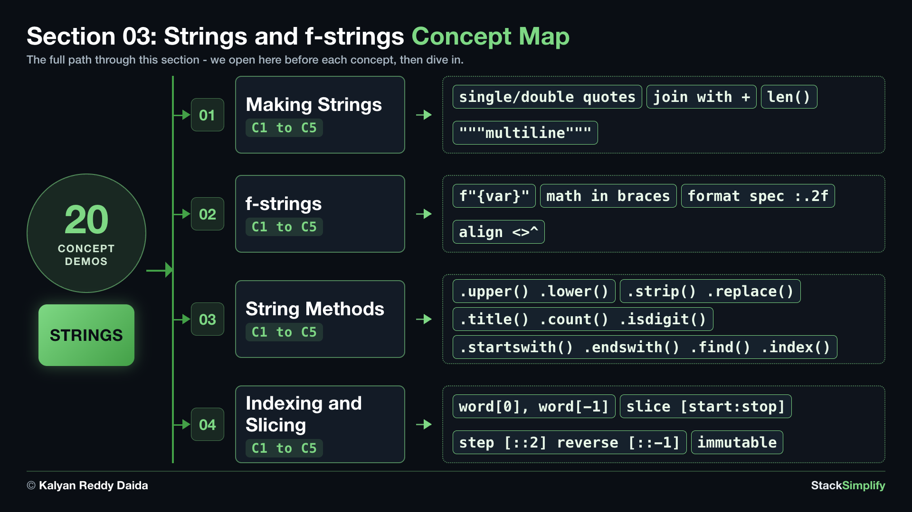

# 03. Strings and f-strings

You already met `str` (text in quotes). Text is everywhere, so this goes deeper: building strings, dropping values into text with **f-strings**, the most useful string **methods**, and picking out characters with **indexing** and **slicing**.

| Concepts | Practice problems | Workshop problems |
|:--------:|:-----------------:|:-----------------:|
| 20 | 4 | 4 |

**Full lessons, worked explanations and every example** are on the course website (for enrolled students):
https://python-for-beginners.stacksimplify.com/03-strings-and-fstrings/

**Section slides (PDF):** [pdfs/03-strings-and-fstrings.pdf](../pdfs/03-strings-and-fstrings.pdf)

## What's inside this section
- `python-learn/`: a runnable worked example for every concept. Run them, change them, break them.
- `python-practice/`: your exercises to solve. Answers are in `python-practice/solutions/`.
- `python-workshop/`: bigger build-it-yourself exercises. Answers are in `python-workshop/solutions/`.

---
Part of StackSimplify's **Python for Absolute Beginners** course. [Get the course](https://stacksimplify.com/courses/python-for-absolute-beginners) | [Course website](https://python-for-beginners.stacksimplify.com/). Learn Python for beginners with hands-on code, practice problems, and projects.
