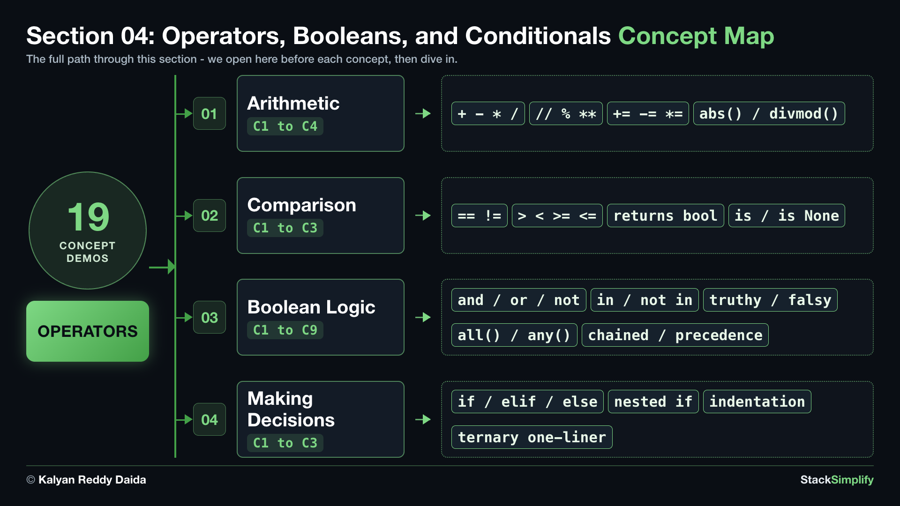

# 04. Operators, Booleans, and Conditionals

Now you make Python *do* things with values: math with **operators**, true-or-false questions with **comparisons** and **booleans**, then **decisions** with `if / elif / else`. This is where programs start to think.

| Concepts | Practice problems | Workshop problems |
|:--------:|:-----------------:|:-----------------:|
| 19 | 4 | 4 |

**Full lessons, worked explanations and every example** are on the course website (for enrolled students):
https://python-for-beginners.stacksimplify.com/04-operators-booleans-and-conditionals/

**Section slides (PDF):** [pdfs/04-operators-booleans-and-conditionals.pdf](../pdfs/04-operators-booleans-and-conditionals.pdf)

## What's inside this section
- `python-learn/`: a runnable worked example for every concept. Run them, change them, break them.
- `python-practice/`: your exercises to solve. Answers are in `python-practice/solutions/`.
- `python-workshop/`: bigger build-it-yourself exercises. Answers are in `python-workshop/solutions/`.

---
Part of StackSimplify's **Python for Absolute Beginners** course. [Get the course](https://stacksimplify.com/courses/python-for-absolute-beginners) | [Course website](https://python-for-beginners.stacksimplify.com/). Learn Python for beginners with hands-on code, practice problems, and projects.
