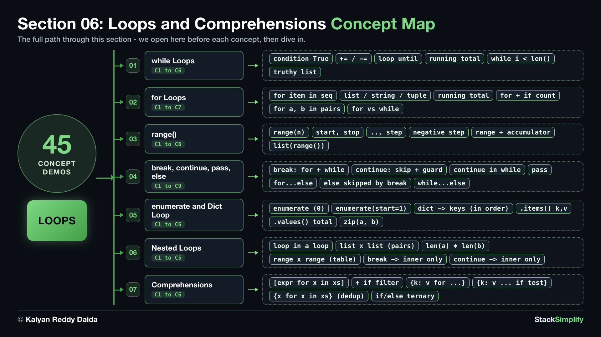

# 06. Loops and Comprehensions

A **loop** repeats work: write it once and let Python run it, for each item in a collection, or while a condition holds. Then **comprehensions** build a list or dictionary in a single line. Loops are the engine room of programming.

| Concepts | Practice problems | Workshop problems |
|:--------:|:-----------------:|:-----------------:|
| 45 | 7 | 7 |

**Full lessons, worked explanations and every example** are on the course website (for enrolled students):
https://python-for-beginners.stacksimplify.com/06-loops-and-comprehensions/

**Section slides (PDF):** [pdfs/06-loops-and-comprehensions.pdf](../pdfs/06-loops-and-comprehensions.pdf)

## What's inside this section
- `python-learn/`: a runnable worked example for every concept. Run them, change them, break them.
- `python-practice/`: your exercises to solve. Answers are in `python-practice/solutions/`.
- `python-workshop/`: bigger build-it-yourself exercises. Answers are in `python-workshop/solutions/`.

---
Part of StackSimplify's **Python for Absolute Beginners** course. [Get the course](https://stacksimplify.com/courses/python-for-absolute-beginners) | [Course website](https://python-for-beginners.stacksimplify.com/). Learn Python for beginners with hands-on code, practice problems, and projects.
