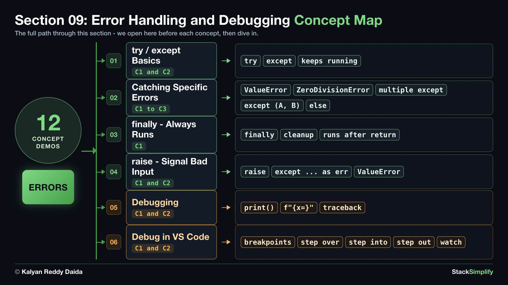

# 09. Error Handling and Debugging

Code goes wrong (bad input, impossible math) and by default Python **crashes**. Here you learn to **catch** problems so your program keeps running, signal bad input on purpose with `raise`, and find bugs, following one running example the whole way.

| Concepts | Practice problems | Workshop problems |
|:--------:|:-----------------:|:-----------------:|
| 12 | 4 | 4 |

**Full lessons, worked explanations and every example** are on the course website (for enrolled students):
https://python-for-beginners.stacksimplify.com/09-error-handling-and-debugging/

**Section slides (PDF):** [pdfs/09-error-handling-and-debugging.pdf](../pdfs/09-error-handling-and-debugging.pdf)

## What's inside this section
- `python-learn/`: a runnable worked example for every concept. Run them, change them, break them.
- `python-practice/`: your exercises to solve. Answers are in `python-practice/solutions/`.
- `python-workshop/`: bigger build-it-yourself exercises. Answers are in `python-workshop/solutions/`.

---
Part of StackSimplify's **Python for Absolute Beginners** course. [Get the course](https://stacksimplify.com/courses/python-for-absolute-beginners) | [Course website](https://python-for-beginners.stacksimplify.com/). Learn Python for beginners with hands-on code, practice problems, and projects.
