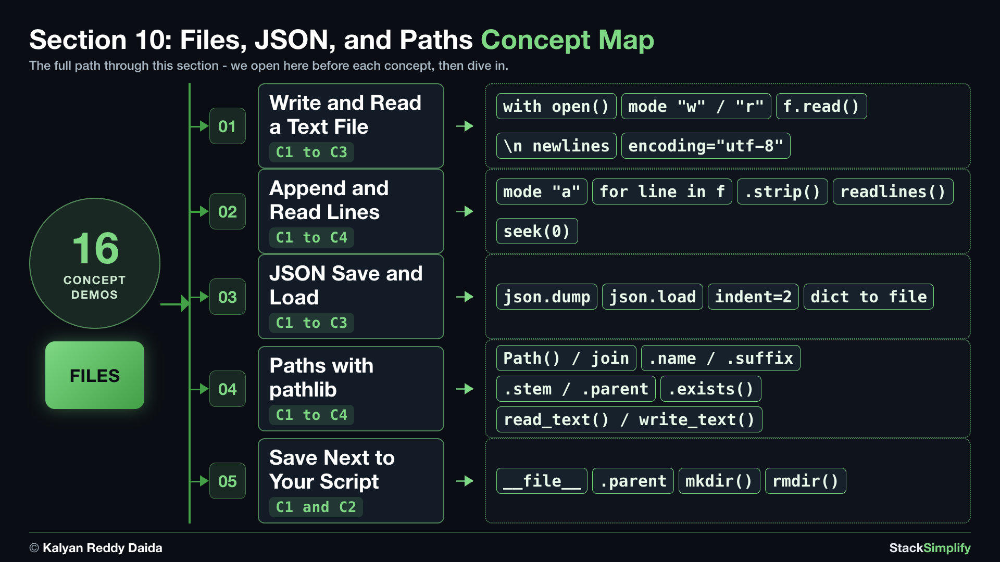

# 10. Files, JSON, and Paths

So far your programs forget everything the moment they stop. Save data to a **file** and read it back: write and read text files, append lines, store structured data as **JSON**, and work with file **paths** the modern way using `pathlib`.

| Concepts | Practice problems | Workshop problems |
|:--------:|:-----------------:|:-----------------:|
| 16 | 5 | 5 |

**Full lessons, worked explanations and every example** are on the course website (for enrolled students):
https://python-for-beginners.stacksimplify.com/10-files-json-and-paths/

**Section slides (PDF):** [pdfs/10-files-json-and-paths.pdf](../pdfs/10-files-json-and-paths.pdf)

## What's inside this section
- `python-learn/`: a runnable worked example for every concept. Run them, change them, break them.
- `python-practice/`: your exercises to solve. Answers are in `python-practice/solutions/`.
- `python-workshop/`: bigger build-it-yourself exercises. Answers are in `python-workshop/solutions/`.

---
Part of StackSimplify's **Python for Absolute Beginners** course. [Get the course](https://stacksimplify.com/courses/python-for-absolute-beginners) | [Course website](https://python-for-beginners.stacksimplify.com/). Learn Python for beginners with hands-on code, practice problems, and projects.
