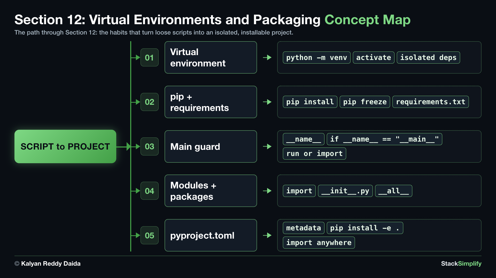

# 12. Virtual Environments and Packaging

So far you have written single `.py` files. Real projects need two habits: a **virtual environment** so each project keeps its own clean set of packages, and organizing code into **modules and packages** you can import. This is the bridge from a script to a project.

| Concepts | Practice problems |
|:--------:|:-----------------:|
| 0 | 3 |

**Full lessons, worked explanations and every example** are on the course website (for enrolled students):
https://python-for-beginners.stacksimplify.com/12-virtual-environments-and-packaging/

**Section slides (PDF):** [pdfs/12-virtual-environments-and-packaging.pdf](../pdfs/12-virtual-environments-and-packaging.pdf)

## What's inside this section
- `python-learn/`: a runnable worked example for every concept. Run them, change them, break them.
- `python-practice/`: your exercises to solve. Answers are in `python-practice/solutions/`.

---
Part of StackSimplify's **Python for Absolute Beginners** course. [Get the course](https://stacksimplify.com/courses/python-for-absolute-beginners) | [Course website](https://python-for-beginners.stacksimplify.com/). Learn Python for beginners with hands-on code, practice problems, and projects.
