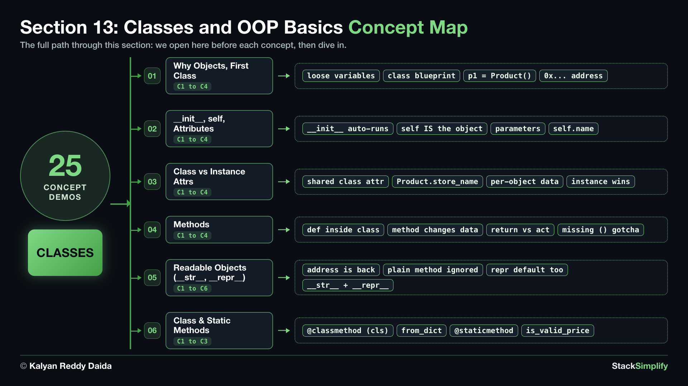

# 13. Classes and OOP Basics

A **class** is a blueprint for making **objects** that bundle related data together. Define a class, create objects from it, add **methods**, give an object a readable printout with `__str__`, and add class-level helpers with `@classmethod` and `@staticmethod`.

| Concepts | Practice problems | Workshop problems |
|:--------:|:-----------------:|:-----------------:|
| 25 | 6 | 6 |

**Full lessons, worked explanations and every example** are on the course website (for enrolled students):
https://python-for-beginners.stacksimplify.com/13-classes-and-oop-basics/

**Section slides (PDF):** [pdfs/13-classes-and-oop-basics.pdf](../pdfs/13-classes-and-oop-basics.pdf)

## What's inside this section
- `python-learn/`: a runnable worked example for every concept. Run them, change them, break them.
- `python-practice/`: your exercises to solve. Answers are in `python-practice/solutions/`.
- `python-workshop/`: bigger build-it-yourself exercises. Answers are in `python-workshop/solutions/`.

---
Part of StackSimplify's **Python for Absolute Beginners** course. [Get the course](https://stacksimplify.com/courses/python-for-absolute-beginners) | [Course website](https://python-for-beginners.stacksimplify.com/). Learn Python for beginners with hands-on code, practice problems, and projects.
