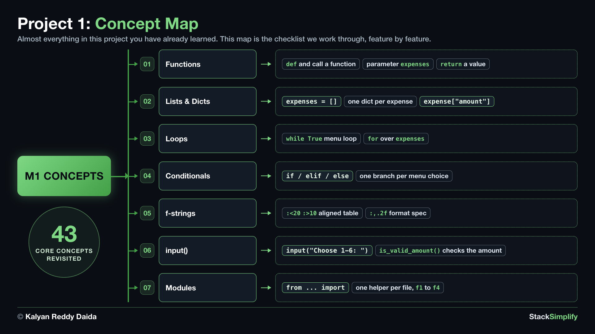

# Milestone Project 1: CLI Expense Tracker

Your first capstone: a command-line Expense Tracker, built with only Sections 01-07, so it works as a checkpoint right after Functions. One small new f-string trick lines up the table columns.

**Full walkthrough and explanation** are on the course website (for enrolled students):
https://python-for-beginners.stacksimplify.com/milestone-project-1/

**Project slides (PDF):** [pdfs/milestone-project-1.pdf](../../pdfs/milestone-project-1.pdf)

## What's inside this project
- `build-incremental-lecture/`: the files you build, all empty. Build the project here, one file per step.
- `build-incremental/`: the same files finished, function by function (see its README for the order). Compare your work with it as you go.
- `solution/`: the complete working project.
- `warmup/` (optional): small drills, one per project function, if you want a run-up before building.

---
Part of StackSimplify's **Python for Absolute Beginners** course. [Get the course](https://stacksimplify.com/courses/python-for-absolute-beginners) | [Course website](https://python-for-beginners.stacksimplify.com/). Learn Python for beginners with hands-on code, practice problems, and projects.
