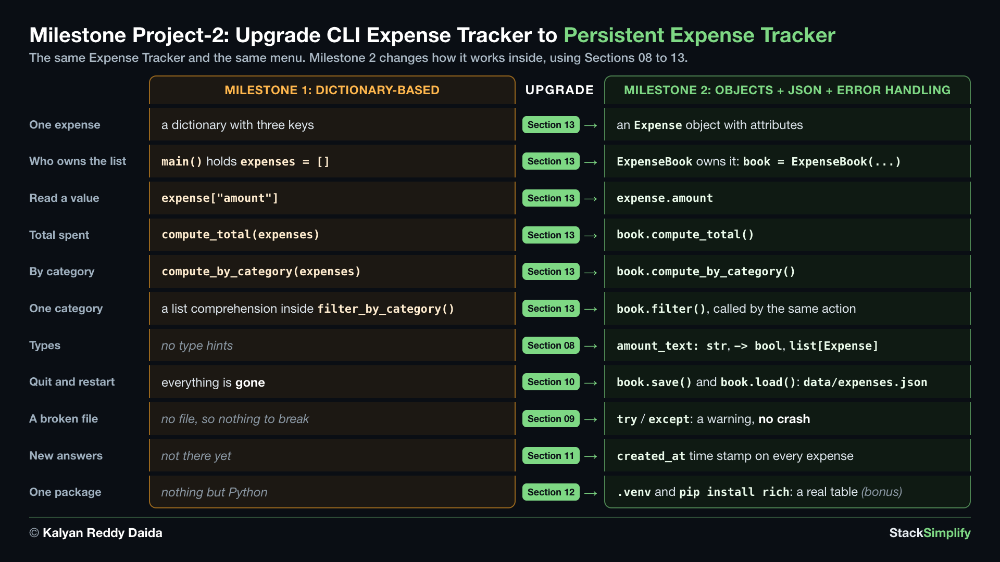

# Milestone Project 2: Persistent Expense Tracker

Your second capstone, and it does not start from a blank folder: you take the Milestone 1 tracker and grow it up with classes, saved data and error handling. Uses Sections 01-13.

**Full walkthrough and explanation** are on the course website (for enrolled students):
https://python-for-beginners.stacksimplify.com/milestone-project-2/

**Project slides (PDF):** [pdfs/milestone-project-2.pdf](../../pdfs/milestone-project-2.pdf)

## What's inside this project
- `01-orig-build-incremental/`: the finished files (see its README for the order). Compare your work with it as you go.
- `02-orig-build-incremental-with-rich/` (optional): the same tracker finished with `rich`, the answer for Step-11.
- `03-orig-warmup/` (optional): small drills, each practicing one new skill the project uses, if you want a run-up before building.
- `04-livecode-build-incremental/`: your starting point, the Milestone 1 files without comments, each function with its one-line docstring. Build the project here, step by step.
- `05-livecode-build-incremental-with-rich/` (optional): the Step-11 workspace, the finished tracker ready for a virtual environment and the `rich` package.

---
Part of StackSimplify's **Python for Absolute Beginners** course. [Get the course](https://stacksimplify.com/courses/python-for-absolute-beginners) | [Course website](https://python-for-beginners.stacksimplify.com/). Learn Python for beginners with hands-on code, practice problems, and projects.
